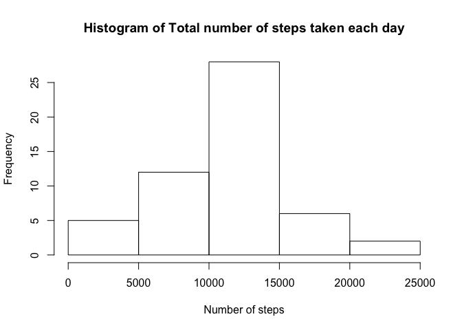
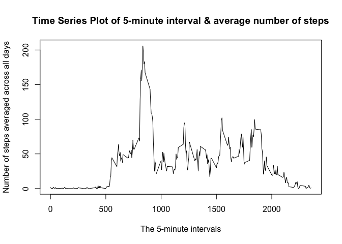
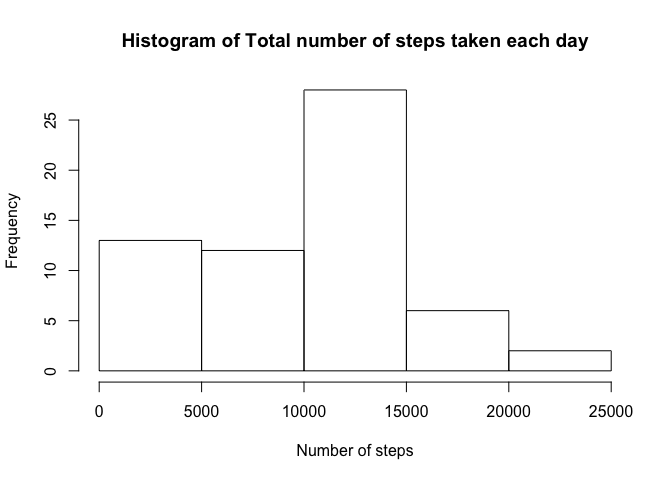
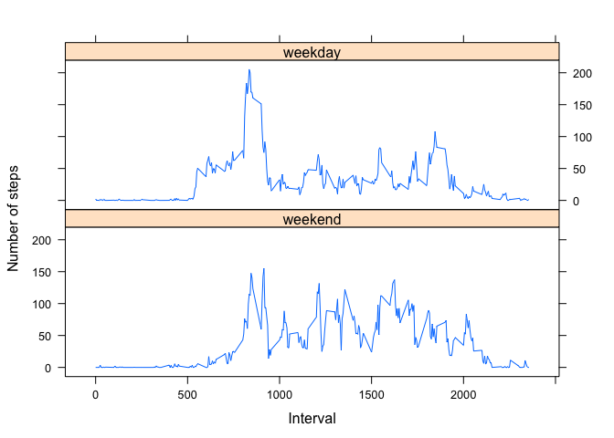

# Reproducible Research: Peer Assessment 1


## Loading and preprocessing the data


```r
x<-read.csv("activity.csv")  
xx <- aggregate(x$steps ~ x$date, FUN=sum)  
```

## What is mean total number of steps taken per day?


```r
# Make a histogram of the total number of steps taken each day
hist(xx[[2]],main="Histogram of Total number of steps taken each day",xlab="Number of steps",ylab="Frequency",breaks = "Sturges")
```

 

```r
# Calculate and report the mean and median total number of steps taken per day
mean_of_total_number_of_steps_taken_per_day<-mean(xx[[2]])  
mean_of_total_number_of_steps_taken_per_day
```

```
## [1] 10766.19
```

```r
median_of_total_number_of_steps_taken_per_day<-median(xx[[2]])  
median_of_total_number_of_steps_taken_per_day
```

```
## [1] 10765
```
Mean of the total number of steps taken per day is 1.0766189\times 10^{4} and median is 10765

## What is the average daily activity pattern?


```r
# Make a time series plot (i.e. type = "l") of the 5-minute interval (x-axis) and the average number of steps taken, averaged across all days (y-axis)
y<-aggregate(x$steps ~ x$interval, FUN="mean")
plot(y[[1]],y[[2]],type="l",xlab="The 5-minute intervals",ylab="Number of steps averaged across all days",main="Time Series Plot of 5-minute interval & average number of steps")
```

 

```r
# Which 5-minute interval, on average across all the days in the dataset, contains the maximum number of steps?
interval_with_max_number_of_steps <- y[[1]][which.max(y[[2]])]
#abline(v=interval_with_max_number_of_steps,col="red")
interval_with_max_number_of_steps
```

```
## [1] 835
```
The 5-minute interval, on average across all the days in the dataset, which contains the maximum number of steps is 835

## Imputing missing values


```r
# Note that there are a number of days/intervals where there are missing values (coded as NA). The presence of missing days may introduce bias into some calculations or summaries of the data.

# Calculate and report the total number of missing values in the dataset (i.e. the total number of rows with NAs)
total_number_of_nas<-sum(is.na(x$steps))
total_number_of_nas
```

```
## [1] 2304
```

```r
# Devise a strategy for filling in all of the missing values in the dataset. The strategy does not need to be sophisticated. For example, you could use the mean/median for that day, or the mean for that 5-minute interval, etc.
# Strategy used : Creating a dataset of the median (to have whole numbers, as opposed to mean) of the 5-minute interval and the average number of steps taken, averaged across all days.  
z<-aggregate(x$steps ~ x$interval, FUN="median")
# Create a new dataset that is equal to the original dataset but with the missing data filled in.
x2<-x
for(i in 1:nrow(x2)){
  if (is.na(x2[i,1])){
   x2[i,1] <- z[which(z[[1]]==x2[i,3]),2] 
  }  
}
# Make a histogram of the total number of steps taken each day and Calculate and report the mean and median total number of steps taken per day. Do these values differ from the estimates from the first part of the assignment? What is the impact of imputing missing data on the estimates of the total daily number of steps?
xx2<-aggregate(x2$steps ~ x2$date, FUN=sum) 
hist(xx2[[2]],main="Histogram of Total number of steps taken each day",xlab="Number of steps",ylab="Frequency",breaks = "Sturges")
```

 

```r
mean_of_total_number_of_steps_taken_per_day2<-mean(xx2[[2]])  
mean_of_total_number_of_steps_taken_per_day2
```

```
## [1] 9503.869
```

```r
median_of_total_number_of_steps_taken_per_day2<-median(xx2[[2]])  
median_of_total_number_of_steps_taken_per_day2
```

```
## [1] 10395
```
Impact of imputing missing data on the estimates of the total daily number of steps :: 

The mean has changed from 1.0766189\times 10^{4} to 9503.8688525
The median has changed from 10765 to 10395

## Are there differences in activity patterns between weekdays and weekends?


```r
#For this part the weekdays() function may be of some help here. Use the dataset with the filled-in missing values for this part.

#1. Create a new factor variable in the dataset with two levels ??? ???weekday??? and ???weekend??? indicating whether a given date is a weekday or weekend day.
x3<-x2
x3$date <- as.Date(x3$date)
weekdays1 <- c('Monday', 'Tuesday', 'Wednesday', 'Thursday', 'Friday')
x3$wDay <- factor((weekdays(x3$date) %in% weekdays1), 
         levels=c(FALSE, TRUE), labels=c('weekend', 'weekday'))
#2. Make a panel plot containing a time series plot (i.e. type = "l") of the 5-minute interval (x-axis) and the average number of steps taken, averaged across all weekday days or weekend days (y-axis). The plot should look something like the following, which was creating using simulated data:
w<-aggregate(x3$steps ~ x3$interval + x3$wDay, FUN="mean")
names(w) <- c("interval","wDay","steps")
library(lattice)
xyplot(steps~interval|wDay, data = w, type = "l", xlab = "Interval", ylab = "Number of steps", layout=c(1,2))
```

 
